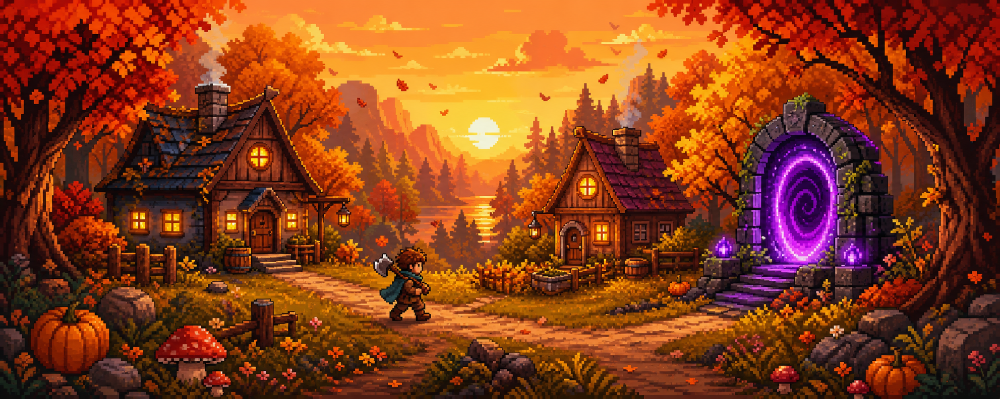

# 🍂 LeafFall — An Autumn Tale

  

  <b>EN</b> · <a href="#-описание-на-русском">RU</a>
  &nbsp;•&nbsp; 🎮 <a href="https://__USER__.github.io/__REPO__/"><b>Play online</b></a>

A cozy **pixel-art autumn indie RPG** in a single HTML file. Choose 1 of 4 heroes, journey through 10 autumn locations, defeat 5 bosses, befriend 40 NPCs and save the Fall itself! 🍁

> 🇷🇺 Русское описание — ниже: [Описание на русском](#-описание-на-русском)

## ✨ Features

- 🦸 **4 playable characters** — Lumberjack, Herbalist, Hunter, Druid — each with unique stats and a special ability
- 🗺️ **10 autumn locations** — from the Sunny Glade to the Hill of Withering
- 👹 **5 bosses** — Mushroom King, Mire Kikimora, Crow Scarecrow, Pumpkin Golem and the Lord of Withering
- 🧑‍🌾 **40 NPCs** with dialogues, shops and quests (even a talking dog 🐕)
- 🎒 **30+ items** — food, 7 weapons, artifacts, crafting/quest materials
- 📜 **24 quests + level progression** — XP for quests and victories, growing HP & attack
- 🌰 Acorn economy, 🔊 retro WebAudio sounds, 💾 autosave, 📱 touch controls, ⛶ fullscreen
- 📦 **Zero dependencies** — the whole game is one `index.html`, works offline

## 🎮 How to play

| Key | Action |
|-----|--------|
| `WASD` / Arrows | Move |
| `Space` / Click | Attack |
| `E` | Talk / use portal |
| `Q` | Special ability |
| `I` / `J` / `M` | Backpack / Journal / Map |
| `F` | Fullscreen |

Talk to NPCs (`!` — new quest, `?` — quest ready to turn in), pick up loot by walking over it, and step into the glowing portal once the location's main quest is done. The game language is Russian 🇷🇺.

**Run locally:** just open `index.html` in any modern browser — no build step, no server needed.

## 🛠️ Tech

Vanilla HTML + CSS + JS, Canvas 2D pixel rendering (480×270 upscaled), procedural autumn maps, WebAudio bleeps. Everything inline — a single self-contained file.

## 📄 License

MIT — see [LICENSE](LICENSE). Made with 🍂 and autumn vibes.

---

## 🍂 Описание на русском

**LeafFall («Листопад: Осенняя сказка»)** — уютная пиксельная осенняя инди-RPG в одном HTML-файле. Выбери 1 из 4 героев, пройди 10 осенних локаций, победи 5 боссов, подружись с 40 NPC и спаси саму Осень! 🍁

### ✨ Что в игре

- 🦸 **4 персонажа** — Лесник, Травница, Охотник, Друидка — у каждого свои характеристики и суперспособность
- 🗺️ **10 локаций** — от Опушки Начал до Холма Увядания
- 👹 **5 боссов** — Грибной Король, Кикимора Трясинная, Пугало Воронье, Тыквенный Голем и Повелитель Увядания
- 🧑‍🌾 **40 NPC** с диалогами, лавками и заданиями (есть даже говорящий пёс Шарик 🐕)
- 🎒 **30+ предметов** — еда, 7 видов оружия, артефакты, материалы для заданий
- 📜 **24 задания + прокачка уровня** — опыт за задания и победы, рост HP и атаки
- 🌰 Экономика на желудях, 🔊 ретро-звуки, 💾 автосохранение, 📱 управление на телефоне, ⛶ полный экран
- 📦 **Ноль зависимостей** — вся игра это один `index.html`, работает без интернета

### 🎮 Управление

| Клавиша | Действие |
|---------|----------|
| `WASD` / стрелки | Движение |
| `Пробел` / клик | Атака |
| `E` | Говорить / портал |
| `Q` | Суперспособность |
| `I` / `J` / `M` | Рюкзак / Журнал / Карта |
| `F` | Полный экран |

Разговаривай с NPC (`!` — новое задание, `?` — можно сдать), собирай лут просто подходя к нему и заходи в светящийся портал, когда главное задание локации выполнено.

**Запуск:** просто открой `index.html` в браузере — ничего собирать и устанавливать не нужно. Или играй онлайн по ссылке выше ☝️
